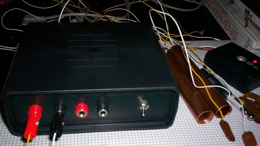

<html lang="en">

<head>

<meta charset="utf-8">
<title>ALGAL16</title>
<meta name="ALGAL16">
<!--[if lt IE 9]>

<![endif]-->

</head>

<body>
<header>
<h2 style="color: black; text-align: center;"> APARĀTS CILVĒKA HARMONIZĀCIJAI UN VESELĪBAS NOSTIPRINĀŠANAI AR ĀDAS ELEKTRISKO
FENOMENU ATGRIEZENISKĀS SAITES PALĪDZĪBU “ALGAL-16”</h2>
</header>

<b>Uzdevumi un iespējas.</b> Aparāts pēc savas uzbūves un programatiskā nodrošinājuma ir paredzēts individuāliem pašizziņas, pašattīstības,
harmonizācijas, pretstresa un veselības nostiprināšanas seansiem un treniņiem, pamatā pēc bioloģiskās atgriezeniskās
 saites principa. Bet, tā kā vairums treniņa programmu atļauj saglabāt datus sekojošai padziļinātai analīzei, tad aparātu var izmantot arī, 
lai savāktu datus, piemēram, ar mērķi tos izmantot turpmākai statistiskai analīzei. Bez tam, tā kā ādas elektriskie fenomeni ir ļoti jūtīgi 
uz visniecīgākajiem (pat zemsliekšņa) kairinātājiem, tad aparāts var tikt izmantots dažādu, citādi neidentificējamu, emocionālu,
 enerģētisku un fizisku faktoru iedarbības objektīvai noteikšanai, kā arī organisma dažādu sistēmu agrīnu homeostāzes traucējumu
 noteikšanai un potenciālo atveseļošanās taktiku izvēlei. Tāpat iespējama sinhrona divu cilvēku emocionālā stāvokļa izzināšana,
 objektīvi nosakot viņu līdzīgo vai atšķirīgo emocionālo reakciju dažādās modelējamās vai dabīgās situācijās, piemēram, kādas
 konkrētas mūzikas klausīšanās laikā.

<b>Priekšrocības.</b> Aparāts atšķiras ar lielu funkcionalitāti – ļoti īsā laikā ir iespējams veidot jaunas programmas, arī izveidot kādus speciālus
devējus, piemērojot katra cilvēka īpašībām, katras darba situācijas vajadzībām, praktiski katras jaunas radošas idejas primārai
 pārbaudei un, iespējams, arī realizācijai. Tādēļ ir iespējams radīt individuālu programmu, vai pat vairākas programmas ne tikai katram
 atsevišķam cilvēkam, bet arī katram jaunam veselības uzlabošanas vai pašattīstības treniņa seansam, tādā veidā ievērojami
 paaugstinot darbības efektivitāti. Tātad, aparāts slēpj sevī lielu radošu potenciālu. Tai pat laikā aparāts pamatā nodrošina arī tādas
 standarta iespējas, kādas piedāvā citi aparāti ar līdzīgu pielietojumu. 

<b>Komplektācija.</b> Aparātam ir divas ieejas ādas elektrisko reakciju devējiem. Aparāts ir komplektēts ar diviem pāriem lielo
 (plaukstas) devēju, diviem pāriem mazo (pirksta) devēju, vienu pāri vidējā izmēra devēju, vienu tausta veida devēju mazāku ādas
 zonu izzināšanai. Aparāta iespējas palielina viens kanāls ar ieeju un devēju pulsogrammas  reģistrācijai.

<b>Konstrukcija, vadība.</b> Visa datu pieraksta un treniņa procesa vadība ir automātiska, un tiek nodrošināta ar divu līmeņu
 programmatūras palīdzību. Atsevišķi tiek programmēta mikroshēma, kas vada datu reģistrācijas un primārās apstrādes
 procesu, un kura, kopā ar elektroniku un komutāciju ir izvietota pašā aparāta korpusā. Mikroshēma nosūta datus datoram,
 kur tos pārtver jau cita, datora programma. Aparāta izstrādē izmantotas daudzas autora “know-how” idejas, vairāki
 tīri tehniskas dabas jauninājumi, kā arī citi būtiski jaunuma elementi no daudziem autora izgudrojumiem, patentiem, grāmatām, žurnālu rakstiem.

<b>Gatavības pakāpe.</b> Aparāts izgatavots vienā eksemplārā, autors veic tā aprobāciju. Autors būs pateicīgs par atbalstu.
 

<i>Visas tiesības uz aparātu un programmām ir aizsargātas:© Alberts Aldersons; medicīnas zinātņu doktors (Dr. Habil. Med.); 
aldalb@inbox.lv, tel. 27180548; Rīga, 2016. gada 20 jūlijs</i>

 <h2 style="color: black; text-align: center;"> ПРИБОР ДЛЯ ГАРМОНИЗАЦИИ И УКРЕПЛЕНИЯ ЗДОРОВЬЯ 
ЧЕЛОВЕКА ПОСРЕДСТВОМ БИОЛОГИЧЕСКОЙ ОБРАТНОЙ СВЯЗИ ПО
ЭЛЕКТРИЧЕСКИМ ФЕНОМЕНАМ КОЖИ “ALGAL16”</h2>

<b>Назначение и возможности.</b> Прибор по основной конструкции и программному
обеспечению предназначен для проведения индивидуальных сеансов и тренировок
саморазвития, укрепления противострессовых механизмов, гармонизации и улучшения здоровья по
принципу биологической обратной связи (БОС). Но, так как большинство тренировочных программ
предоставляют возможность сохранения данных для последующего углубленного анализа, то прибор
можно использовать и для сбора данных, например, с целью их последующей статистической обработки. Кроме того, так как 
электрические феномены
кожи являются очень чувствительными к ничтожным (даже подпороговым) раздражителям, то
аппарат может быть использован для определение разных, иначе неидентифицируемых
эмоциональных, энергетических, физических факторов, а также для определения нарушений
гомеостаза различных систем организма и выбора оптимальных потенциальных тактик оздоровления.
Также возможно синхронное определение эмоционального состояния двух людей, объективно
определяя похожую или различную их эмоциональную реакцию в различных моделируемых или
естественных ситуациях, например, во время прослушивания какого - то конкретного произведения
музыки.

<b>Преимущества. </b> Прибор отличается большой функциональностью — в очень короткое время
можно создать новые программы, как и создать новые датчики, приспосабливая их к особенностям
каждого человека, к требованиям новой рабочей ситуации, для первичной проверки и, возможно, и
реализации каждой новой творческой идеи. В связи с этим возможно создать индивидуальную
программу, или даже несколько программ, не только для каждого человека, но и даже для каждого
нового сеанса по укреплению здоровья или саморазвития, тем самым значительно повышая
эффективность работы. Следовательно, прибор скрывает в себе большой творческий потенциал.
Вместе с тем, прибор обеспечивает и все те возможности, какие предлагают другие аппараты
подобного назначения.

<b>Комплектация.</b> Прибор снабжен двумя входами для датчиков электрических реакций кожи. К
прибору прилагаются: две пары больших (ладонных) датчиков, две пары маленьких (пальцевых)
датчиков, одна пара средних датчиков, один датчик в виде щупа для исследования более мелких
кожных зон. Возможности аппарата расширены одним дополнительным каналом с входом и датчиком
для регистрации пульсограммы.

<b>Конструкция, управление.</b> Все управление процессом записи и тренировки осуществляется
автоматически, путем двухуровневого программного обеспечения. Отдельно программируется
микросхема управления процессом записи и первичной обработки данных, которая вместе с
электроникой и коммутацией расположена собственно в самом приборе. Микросхема посылает
данные в компьютер, где они улавливаются уже другой, компьютерной программой. В разработке
прибора использованы многие «know-how” идеи автора, ряд чисто технических новшеств, а также
существенные новшества из нескольких изобретений, патентов, книг и статей автора.

<b>Степень готовности.</b> Аппарат изготовлен в одном экземпляре, автор
проводит его апробацию. Автор будет благодарен за поддержку.
 

<i>Все права на аппарат и программы защищены: © Алдерсонс
Албертс.Албертович, доктор медицинских наук, Dr. Habil. Med.,
aldalb@inbox.lv, тел. 27180548; Рига, 20 июля 2016 г.,</i>

</body> 

